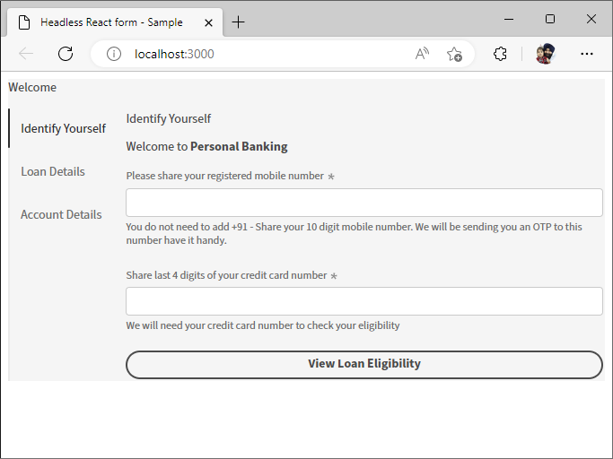

# Getting Started {#introduction}

Starting with Headless adaptive forms is quite easy and quick. Clone the ready-made React project, install the dependencies, and run the project. You have a Headless adaptive form integrated in a React App up and running. You can use the sample react project to build and test Headless adaptive forms before deploying it in a production environment. Let's start:

## Before you start {#pre-requisites}

To create and run a React app, you should have Node.js and npm (Node Package Manager) installed on your computer:

*   Install the [latest release of Git](https://git-scm.com/downloads). If you are new to Git, see [Installing Git](https://git-scm.com/book/en/v2/Getting-Started-Installing-Git).

*   Install [Node.js 16.13.0 or later](https://nodejs.org/en/download/). If you are new to Node.js, see [How to install Node.js](https://nodejs.dev/en/learn/how-to-install-nodejs).

## Get Started

Once you fullfill the requirements, perform the following steps to get started quickly with developing and styling a Headless adaptive form:

1.  [Setup Headless adaptive forms starter kit](#setup)

1.  [Preview the Headless adaptive form included in the starter kit](#preview)

1.  [Create and render your own Headless adaptive form](#custom)

    
>[!NOTE]
>
>
> The starter kit helps you get started quickly using a React app. You are free to develop and use Headless adaptive forms in an Angular, Vanilla JS, and other development environments of your choice. 


## 1.  Setup Headless adaptive forms starter kit {#install}

The starter kit is a React app with a sample Headless adaptive form and corresponding libraries. Use the kit to develop and test your Headless adaptive forms and corresponding React components. Run the following commands to setup Headless adaptive forms starter kit:

1.  Open command prompt and run the following command:

    ```shell

    git clone https://github.com/adobe/react-starter-kit-aem-headless-forms

    ```

    The command creates a directory called "react-starter-kit-aem-headless-forms" in your current location and clones the Headless adaptive forms React starter app into it.

1.  Navigate to the **react-starter-kit-aem-headless-forms** directory and run the following command to install the dependencies:

    ```shell

    npm install

    ```

    The command downloads all of the necessary packages and libraries needed to run and build the app, such as React, ReactDOM, and Headless adaptive forms 
    libraries (@aemforms/af-react-renderer, @aemforms/af-react-components, @adobe/react-spectrum) required to render form, run validations, and persist data for instances of the form. 

    


## 2. Preview the Headless adaptive form {#preview}

After setting up the starter kit, you can preview the sample Headless adaptive form, replace it with your own custom form. You can also configure the starter kit to retrieve a form from an AEM Forms server.

Use the following command to run the app: 

  ```shell

    npm start

  ```

   
  This command starts a local development server, and opens the sample Headless adaptive form, included in starter app, in your default web browser.

  

  Voila! Your are all setup to start developing a custom Headless adaptive form. 
    
  <!--  As you know, in a headless form the form data and logic are separate from the presentation layer and can be used by any client that can make HTTP requests, such as a mobile app, a static site, or a different web application. The form is often managed and stored on a server, which serves as the backend for the form. The client sends requests to the server to retrieve the form, submit data, and receive updated form data. This allows for greater flexibility and integration with different technologies. You can store and retrive a Headless adaptive form on an AEM Server  -->

## 3. Create and render your own Headless adaptive form{#custom}

A Headless adaptive form represents the form and its components, such as fields and buttons, in JSON (JavaScript Object Notation) format. The advantage of using JSON format is that it can be easily parsed and used by various programming languages, making it a convenient way to exchange form data between systems. To view the sample Headless adaptive form included with the app, open the `/react-starter-kit-aem-headless-forms/form-definations/form-model.json` file. 

Let's create a contact us form that four fields: "Name", "Email", "Phone No", and "Message". The fields are defined as objects (items) within the JSON, with each object (item) having properties such as type, label, name, and required. The form also has a button with of type "submit". Here is JSON for the form. 


```JSON
{
  "afModelDefinition": {
    "adaptiveform": "0.10.0",
    "items": [
      {
        "fieldType": "text-input",
        "label": {
          "value": "Name"
        },
        "name": "name"
      },
      {
        "fieldType": "text-input",
        "format": "email",
        "label": {
          "value": "Email"
        },
        "name": "email"
      },
      {
        "fieldType": "text-input",
        "format": "phone",
        "pattern": "[0-9]{10}",
        "label": {
          "value": "Phone"
        },
        "name": "Phone"
      },
      {
        "fieldType": "multiline-input",
        "label": {
          "value":"Message"
        },
        "name": "message"
      },
      {
        "fieldType": "button",
        "label":{
          "value": "Submit"
        },
        "name":"submit",
        "events":{
          "click": "submitForm()"
        }
      }
    ],
    "action": "https://eozrmb1rwsmofct.m.pipedream.net",
    "description": "Sample form",
    "title": "Sample Form",
    "metadata": {
      "grammar": "json-formula-1.0.0",
      "version": "1.0.0"
    }
  }
}

```

>[!NOTE]
>
> * The "afModelDefinition" attribute is only needed for React applications and is not a part of the form definition.
> * You can hand-craft the JSON or use the adaptive forms editor (adaptive forms WYSIWYG editor) to create the JSON.


To render the form, replace the sample Headless adaptive form JSON `/react-starter-kit-aem-headless-forms/form-definations/form-model.json` with the above JSON, save the file, wait for the starter-kit to compile and refresh the form.    


<!-- Your form is ready. Let's add some validations and make "Name", "Email", and "Message" fields mandatory. -->

 
## Next step

You have sucessfully rendered the Headless Adaptive Form. By default, the starter kit uses [Adobe's Spectrum](https://spectrum.adobe.com/) components. The next step is to [use a custom react library to render a headless form](use-google-material-ui-react-components-to-render-a-headless-form.md)

    