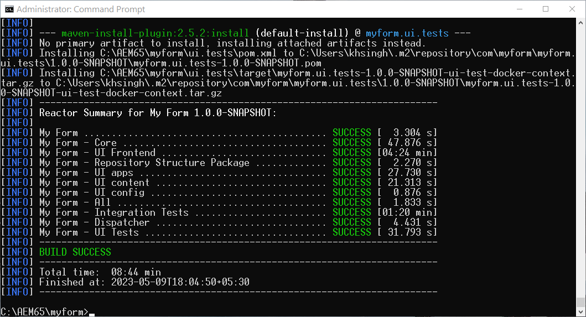

# Enable Headless Adaptive Forms on AEM 6.5 Forms {#enable-headless-adaptive-forms-on-aem-65-forms}

To enable Headless Adaptive Forms on your AEM 6.5 Forms environment, set up an AEM Archetype 41 or later based project and deploy it to all of your Author and Publish instances. 

By deploying the AEM Archetype 41 or later based project to your AEM 6.5 Forms instances, you gain the ability to [create Core Components based Adaptive Forms](create-a-headless-adaptive-form.md). These forms are represented in JSON format and  used as Headful and Headless Adaptive Forms, allowing for greater flexibility and customization across a range of channels, including mobile, web, and native apps.

## Prerequisites {#prerequisites}

Before enabling Headless Adaptive Forms on AEM 6.5 Forms environment, 

*   [Upgrade to AEM 6.5 Forms Service Pack 16 (6.5.16.0) or later](https://experienceleague.adobe.com/docs/experience-manager-65/release-notes/aem-forms-current-service-pack-installation-instructions.html). 

*   Install the latest release of [Apache Maven](https://maven.apache.org/download.cgi).

*   Install a plain text editor. For example, Microsoft Visual Studio Code. 

## Create and deploy latest AEM Archetype based project 

To create an AEM Archetype 41 or [later](https://github.com/adobe/aem-project-archetype) based project and deploy it to all of your Author and Publish instances:  

1.  Log in to your computer, hosting and running your AEM 6.5 Forms instance, as an Administrator.
1.  Open the command prompt or terminal. 
1.  Run the following command to create AEM Archetype 41 based project:

    * Microsoft Windows
    
     ```Shell
     
        mvn -B org.apache.maven.plugins:maven-archetype-plugin:3.2.1:generate ^
        -D archetypeGroupId=com.adobe.aem ^
        -D archetypeArtifactId=aem-project-archetype ^
        -D archetypeVersion=41 ^
        -D appTitle="My Form" ^
        -D appId="myform" ^
        -D groupId="com.myform" ^
        -D includeFormsenrollment="y" ^
        -D aemVersion="6.5.15" 

     ```

    * Linux or Apple macOS

     ```Shell

        mvn -B org.apache.maven.plugins:maven-archetype-plugin:3.2.1:generate \
        -D archetypeGroupId=com.adobe.aem \
        -D archetypeArtifactId=aem-project-archetype \
        -D archetypeVersion=41 \
        -D appTitle="My Form" \
        -D appId="myform" \
        -D groupId="com.myform" \
        -D includeFormsenrollment="y" \
        -D aemVersion="6.5.15" 

     ```    

    When you execute the above command, be sure to consider the following points:

    *   Update the command to reflect the specific values for your environment, including the appTitle, appId, and groupId. Also, set the values for includeFormsenrollment to 'y'. If you use Forms Portal, set the _includeExamples=y_ option to include Forms Portal Core Components in your project.

    *   Do not change the 'aemVersion' from 6.5.15.0 to anything else.  

1.  (Only for Archetype version 41 based projects) After the AEM Archetype project is created, enable themes for Core Components based Adaptive Forms. To enable themes:  

    1.  Open the [AEM Archetype Project Folder]/ui.apps/src/main/content/jcr_root/apps/__appId__/components/adaptiveForm/page/customheaderlibs.html for editing:

    1.  Add the following code at line 21: 

        ```XML 

        <sly data-sly-use.clientlib="core/wcm/components/commons/v1/templates/clientlib.html"
        data-sly-use.formstructparser="com.adobe.cq.forms.core.components.models.form.FormStructureParser"
        data-sly-test.themeClientLibRef="${formstructparser.themeClientLibRefFromFormContainer}">
        <sly data-sly-test="${themeClientLibRef}" data-sly-call="${clientlib.css @ categories=themeClientLibRef}"/>
        </sly>

        ```

        

    1.  Save and close the file. 

1.  Update project to include latest version of Forms Core Components: 

     1.  Open the [AEM Archetype Project Folder]/pom.xml for editing. 
     1.  Set version of `core.forms.components.version` and `core.forms.components.af.version` to [latest Forms Core Components](https://github.com/adobe/aem-core-forms-components/tree/release/650) version.
     
         

     1.  Save and close the file.  


1.  After the AEM Archetype project is created successfully, build the deployment package for your environment. To build the package:
    
    1.  Navigate to the root directory of your AEM Archetype project. 


    1.  Run the following command to build the AEM Archetype project for your environment: 

        ```Shell
        
        mvn clean install


        ```

        


    After the AEM Archetype project is successfully built, an AEM Package is generated. You can find the package at [AEM Archetype Project Folder]\all\target\[appid].all-[version].zip

1.  Use the [Package Manager](https://experienceleague.adobe.com/docs/experience-manager-65/administering/contentmanagement/package-manager.html?lang=en) to deploy the [AEM Archetype Project Folder]\all\target\[appid].all-[version].zip package on all the Author and Publish instances.

>[!NOTE]
>
>
>
>In case you encounter difficulty accessing the login dialog on a publish instance to install the package through the Package Manager, try logging in through the following URL: http://[Publish Server URL]:[PORT]/system/console. This allows you access to login to Publish instance, allowing you to proceed with the installation process.


The Core Components are enabled for your environment. A blank Core Components based Adaptive Form template and Canvas 3.0 theme are deployed to your environment, enabling you to [create Core Components based Adaptive Forms](create-a-headless-adaptive-form.md).

## Frequently Asked Questions

### What are core components?

The [Core Components](https://experienceleague.adobe.com/docs/experience-manager-core-components/using/introduction.html) are a set of standardized Web Content Management (WCM) components for AEM to speed up development time and reduce maintenance cost of your websites. 

### What all is capabilities are added on enabling core components?


When the  Adaptive Forms Core Components are enabled for your environment, a blank Core Components based Adaptive Form template and Canvas 3.0 theme are added to your environment. After enabling Adaptive Forms Core Components for your environment, you can:

* Create Core Components based Adaptive Forms.
* Create Core Components based Adaptive Form templates.
* Create custom themes for Core Components based Adaptive Form templates.
* Serve Core Component based Adaptive Form's JSON representations to channels such as mobile, web, native apps, and services that require a form's headless representation.
