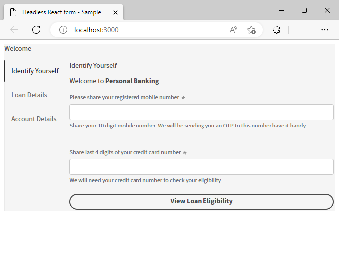

# Getting Started {#introduction}

Starting with Headless Adaptive Forms is quite easy and quick. Clone the ready-made React project, install the dependencies, and run the project. You have a Headless Adaptive Form integrated in a React App up and running. You can use the sample react project to build and test Headless Adaptive Forms before deploying it in a production environment. Let's start:

<!--
## Before you start {#pre-requisites}

To create and run a React app, you should have Node.js and npm (Node Package Manager) installed on your computer:

* Install the [latest release of Git](https://git-scm.com/downloads). If you are new to Git, see [Installing Git](https://git-scm.com/book/en/v2/Getting-Started-Installing-Git).

* Install [Node.js 16.13.0 or later](https://nodejs.org/en/download/). If you are new to Node.js, see [How to install Node.js](https://nodejs.dev/en/learn/how-to-install-nodejs).

## Setup starter React app and render a Headless Adaptive Form {#install}

Once you fullfill the requirements, you can run the following commands to create a starter React app and render a sample Headless Adaptive Form:

1. Open command prompt and run the following command to clone the starter Headless Adaptive Forms React app:

    ```shell

    git clone https://git.corp.adobe.com/barshatr/aem-headless-forms-app-starter

    ```

    

    This command creates a new directory called *aem-headless-forms-app-starter* inside the current directory, and generates the necessary files for starter Headless Adaptive Forms React app.

1. Navigate to the **aem-headless-forms-app-starter** directory and run the following command to install the dependencies:

    ```shell

    npm install

    ```

    

1. Use the following command to run the app: 

    ```shell

    npm start

    ```

   
    This command starts a local development server, and opens the sample Headless Adaptive Form, included in starter app, in your default web browser.

    


  A Headless Adaptive Forms is represented as a JSON file. To view JSON structure of the sample Headless Adaptive Form included with the app, open the `/aem-headless-forms-app-starter/form-definations/form-model.json` file. 

```JSON

    {
      "adaptiveform": "0.0.10",
      "metadata": {
        "version": "1.0.0"
      },
      "items": [
        {
          "name": "firstName",
          "fieldType": "text-input",
          "default": "john",
          "type": "string",
          "minLength": 0,
          "maxLength": 30,
          "required": true,
          "constraintMessages": {
            "minLength": "Name cannot be empty",
            "maxLength": "Please enter only first 30 characters of your name",
            "required": "Name cannot be empty"
          },
          "description": "We need it to address you in our responses",
          "screenReaderText": "'Enter your name as you like us to address you'",
          "rules": {
            "required": "$form.isAnonymous.$value != true"
          },
          "label": {
            "value": "First Name"
          }
        },
        {
          "name": "lastName",
          "fieldType": "text-input",
          "default": "doe",
          "description": "We need it to address you in our responses",
          "screenReaderText": "Enter your name as you like us to address you",
          "type": "string",
          "minLength": 0,
          "maxLength": 30,
          "required": true,
          "constraintMessages": {
            "minLength": "Name cannot be empty",
            "maxLength": "Please enter only first 30 characters of your name",
            "required": "Name cannot be empty"
          },
          "rules": {
            "required": "$form.isAnonymous.$value != true"
          },
          "label": {
            "value": "Last Name"
          }
        },
        {
          "name": "name",
          "fieldType": "text-input",
          "rules": {
            "value": "$form.firstName.$value & ' ' & $form.lastName.$value"
          },
          "label": {
            "value": "Your Full Name"
          }
        },
        {
          "name": "email",
          "fieldType": "text-input",
          "description": "It's a promise that we will not spam you",
          "screenReaderText": "Provide your email address so that we can reply to you.",
          "type": "string",
          "format": "email",
          "required": true,
          "constraintMessages": {
            "format": "Please enter a valid email address",
            "required": "The email address is mandatory"
          },
          "rules": {
            "required": "$form.isAnonymous.$value != true"
          },
          "label": {
            "value": "Email Address"
          }
        },
        {
          "name": "isAnonymous",
          "fieldType": "checkbox",
          "description": "In case you want to remain anonymous",
          "type": "boolean",
          "required": true,
          "label": {
            "value": "Remain Anonymous",
            "richText": false,
            "visible": false
          }
        },
        {
          "name": "phone",
          "fieldType": "text-input",
          "description": "Your mobile number where we can reach you. But only if you want",
          "screenReaderText": "Enter you mobile number without the ISD code",
          "pattern": "[0-9]{10}",
          "constraintMessages": {
            "pattern": "Phone number must be 10 digit long"
          },
          "label": {
            "value": "Mobile Number"
          }
        },
        {
          "name": "submit",
          "fieldType": "button",
          "screenReaderText": "Enter your message in less than 1000 characters and minimum 50 characters",
          "events": {
            "click": "dispatchEvent($form, 'submit')"
          },
          "label": {
            "value": "Submit"
          }
        }
      ]
    }

```

## Change default style of a Headless Adaptive Form

The default form in the starter app uses Adobe's Spectrum UI components style the form. Headless Adaptive Forms allows you to use your own UI components to render a form. Let's set the default form to use Google's Material UI:

1. Install the Google Material UI npm library. To install, open command prompt, navigate to the **aem-headless-forms-app-starter** directory, and run the following command:

    ```shell
    
    npm install @mui/material @emotion/react @emotion/styled --force
    
    ```

    This installs the Material UI library, and adds it to your project's dependencies. You can then import and use    Material UI components in your React app. 

1. Next steps are to create custom components, update your JSON file to use custom components, and update the mappings file. Let's learn to do it with the help of a button component: 

      1. Create a custom buttons component that uses Material UI:
         1. In your starter app project, navigate to `\aem-headless-forms-app-starter\src\components`, create a copy of the       slider or richtext folder, and rename the copied folder to `materialbutton`. Slider and richtext are two sample       custom components available in the starter app. You can these to create your own custom components.
         1. Open the `\aem-headless-forms-app-starter\src\components\materialbutton\index.tsx` file. Add the following      statement to import the Material UI button component to your starter app:

      1. Updated the form-model.json file to use custom buttons component: 
          1. Open the `/aem-headless-forms-app-starter/form-definations/form-model.json` file for editing.
          1. Change `"fieldType": "button"` to `"fieldType": "custom:button"` and save the file.
         
            ```JSON

            import Button from '@material-ui/core/Button';

            ```

            Then, replace the the Slider component tag with Button component tag:


          ```JSON

          <Slider {...res} {...actions}  />

          ```

          with

          ```JSON

          <Button>Primary</Button>


            and replace the slider component tag with button 
          1. 


         and replace 

          ```JSON

          <Slider {...res} {...actions}  />

          ```

          with

          ```JSON

          <Button>Primary</Button>

          ```

## Use a custom form with sample Headless Forms app

You can configure the app to fetch a Headless Adaptive Form from an AEM Forms Server or replace the sample Headless Adaptive Form included with the app to a custom Headless Adaptive Form. By default, the app is configured to use the sample Headless Adaptive Form included with the app. You can get some sample/custom Headless Adaptive Form JSON from [Storybook](https://opensource.adobe.com/aem-forms-af-runtime/storybook/?path=/story/reference-examples--contact). Use the **Raw** option on Storybook to view JSON structure of the form.


### Replace the sample Headless Adaptive Form included with the app to a custom Headless Adaptive Form

1. Open the  /aem-headless-forms-app-starter/form-definations/form-model.json file for editing.
1. Replace the content of the **afModelDefinition** property with your custom Headless Adaptive Form. For example, when you use the [Contact](https://opensource.adobe.com/aem-forms-af-runtime/storybook/?path=/story/reference-examples--contact) form the final content of the file look like the following:


    ``` JSON

        {
        "afModelDefinition": {
        "adaptiveform": "0.0.10",
        "metadata": {
        "version": "1.0.0"
        },
        "items": [
        {
            "name": "firstName",
            "fieldType": "text-input",
            "default": "john",
            "type": "string",
            "minLength": 0,
            "maxLength": 30,
            "required": true,
            "constraintMessages": {
            "minLength": "Name cannot be empty",
            "maxLength": "Please enter only first 30 characters of your name",
            "required": "Name cannot be empty"
            },
            "description": "We need it to address you in our responses",
            "screenReaderText": "'Enter your name as you like us to address you'",
            "rules": {
            "required": "$form.isAnonymous.$value != true"
            },
            "label": {
            "value": "First Name"
            }
        },
        {
            "name": "lastName",
            "fieldType": "text-input",
            "default": "doe",
            "description": "We need it to address you in our responses",
            "screenReaderText": "Enter your name as you like us to address you",
            "type": "string",
            "minLength": 0,
            "maxLength": 30,
            "required": true,
            "constraintMessages": {
            "minLength": "Name cannot be empty",
            "maxLength": "Please enter only first 30 characters of your name",
            "required": "Name cannot be empty"
            },
            "rules": {
            "required": "$form.isAnonymous.$value != true"
            },
            "label": {
            "value": "Last Name"
            }
        },
        {
            "name": "name",
            "fieldType": "text-input",
            "rules": {
            "value": "$form.firstName.$value & ' ' & $form.lastName.$value"
            },
            "label": {
            "value": "Your Full Name"
            }
        },
        {
            "name": "email",
            "fieldType": "text-input",
            "description": "It's a promise that we will not spam you",
            "screenReaderText": "Provide your email address so that we can reply to you.",
            "type": "string",
            "format": "email",
            "required": true,
            "constraintMessages": {
            "format": "Please enter a valid email address",
            "required": "The email address is mandatory"
            },
            "rules": {
            "required": "$form.isAnonymous.$value != true"
            },
            "label": {
            "value": "Email Address"
            }
        },
        {
            "name": "isAnonymous",
            "fieldType": "checkbox",
            "description": "In case you want to remain anonymous",
            "type": "boolean",
            "required": true,
            "label": {
            "value": "Remain Anonymous",
            "richText": false,
            "visible": false
            }
        },
        {
            "name": "phone",
            "fieldType": "text-input",
            "description": "Your mobile number where we can reach you. But only if you want",
            "screenReaderText": "Enter you mobile number without the ISD code",
            "pattern": "[0-9]{10}",
            "constraintMessages": {
            "pattern": "Phone number must be 10 digit long"
            },
            "label": {
            "value": "Mobile Number"
            }
        },
        {
            "name": "submit",
            "fieldType": "button",
            "screenReaderText": "Enter your message in less than 1000 characters and minimum 50 characters",
            "events": {
            "click": "dispatchEvent($form, 'submit')"
            },
            "label": {
            "value": "Submit"
            }
        }
        ]
    }
    }

    ```

1. Save the file. Wait for Webpack to render the form. The browser window is automatically refreshed after the webpack bundle is ready.


--> 