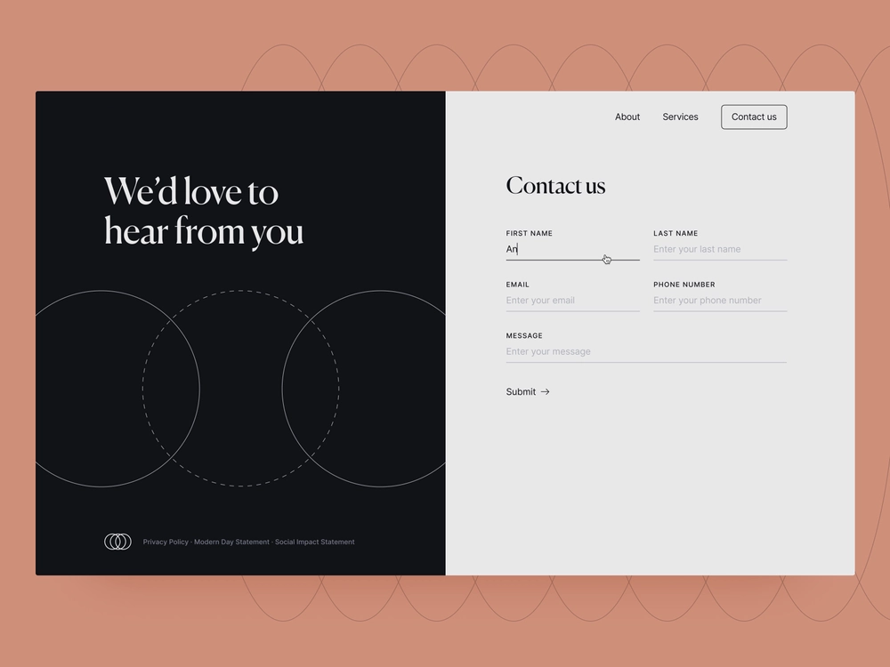

# Getting Started with Headless Adaptive Forms

This tutorial provides you an end-to-end framework to create a Headless Adaptive Form. The tutorial is organized into a use case and multiple guides. Each guide helps you learn and add new features to the Headless Adaptive Form that is created in this tutorial. You have a working Headless Adaptive Form after every guide. At the end of this tutorial, you will be able to:

* Create a Headless Adaptive Form
* Add business rules to your form
* Use Google material UI to style form
* Prefill your form 
* Embed your form to a webpage

You will also build an understand of architecture, available artifacts, and JSON structure of Headless Adaptive Forms.

**The journey starts with learning the use case**:

Raya tan works in foreign department of a beautiful country, full of natural landscapes, and their economy is built around international tourism. Her country's foreign department provides visa forms to tourists via a website, native apps, and in PDF format. The forms are available in multiple locales and tourists can choose to fill forms in language of their choice. 

These forms are built on different technologies, there is a different version of these forms for each platform (Website, Mobile apps, and Printable PDFs),  and it is harder to scale these for enterprise class use cases, such as, auto-translation, demography-based targeting, standard-based rule building, performance analysis and more.

The foreign department has decided to move to Headless Adaptive Forms to use its decoupled architecture, where frontend is independent of backend. They plan to use react components of Google Material UI to develop frontend experience for these forms while using backend capabilities for Digital Signatures, Data Integrations, Business Process Management, Document of Record, and Usage Analytics.

Tourists use contact us form to ask various queries. It is the most sought after form in the department. It is the first form the foreign department is looking to build on Headless Adaptive Forms architecture. This tutorial teaches how to create the contact us form. Here is how the final form looks: 

