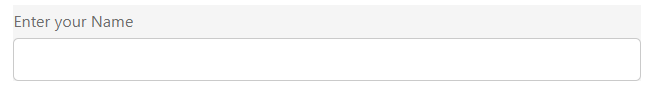

# Render your first headless adaptive form

This section describes how to render a sample headless adaptive form within a React app. It assumes you are comfortable with creating and developing frontend applications using React. First, you create a React app and add Headless Adaptive Forms specific dependencies to the React App. Then, you add the Headless Adaptive Form to the app and run the app to preview the form. Let's start:

## Create a React app and add Headless Adaptive Forms specific dependencies to the app


1. To create the React App, open the command prompt, and run the below command:

    ```shell
    npx create-react-app [react-app] --scripts-version 4.0.3 --template typescript
    ```

    Where [react-app] represents name of the project, script version is 4.0.3, and template of type typescript. For example, the following command creates a react app named *headless-forms-demo*.

    ```shell
    npx create-react-app headless-forms-demo --scripts-version 4.0.3 --template typescript
    ```

    It may take some time to create the app and install all the dependencies. The command creates a React app with latest version of `react` and `react-dom` dependencies. It does not have any artifacts related to Adaptive Forms.

    

1. To install Headless Adaptive Forms dependencies, navigate to your [react-app] folder, and run the below commands in the listed order:

      ```shell
      npm install --save react@16.0.0 react-dom@16.14.0 -force
      ```

    

      ```shell
      npm i --save @aemforms/af-react-components @aemforms/af-react-renderer @aemforms/af-core @adobe/react-spectrum react-intl
      ```

    

    After the dependencies are installed, you are all set to add and use Headless Adaptive Form to your React app.


## Add a Headless Adaptive Form to the app and run the app to preview the form

A Headless Adaptive Forms is represented as a JSON file. The [Storybook](https://opensource.adobe.com/aem-forms-af-runtime/storybook/?path=/story/reference-examples--contact) has many examples of Headless Adaptive forms. This document uses the [introduction](https://opensource.adobe.com/aem-forms-af-runtime/storybook/?path=/story/reference-examples--introduction) form.

1. Open your project in an IDE. You can use any IDE. Examples in this document are based on Microsoft Visual Source Code.


1. Create the `src/demo.form.json` file and the following Headless Adaptive Form JSON content to it.

   ```JSON

     {
     "adaptiveform": "0.10.0",
     "items": [
       {
         "fieldType": "text-input",
         "label": {
           "value": "Enter your Name"
         },
         "name": "textInput"
       }
     ],
     "metadata": {
       "grammar": "json-formula-1.0.0",
       "version": "1.0.0"
     }
   }

   ```
   The above JSON content adds a single field to the form to the React project:
    

1. Create the `src/Form.tsx` file and add the following code to it.

    ```JSON

    import {mappings} from '@aemforms/af-react-components'
    import {AdaptiveForm} from '@aemforms/af-react-renderer';

    import json from './demo.form.json';

    const Example = () => (<AdaptiveForm mappings={mappings} formJson={json}  />)
    export default Example

    ```
    The above code passes your Headless Adaptive Form's JSON file to the Headless Adaptive Forms renderer component. The renderer component converts the JSON file to an HTML form. It also applies the rules and constraints defined in the JSON file to the fields of the form. The React Renderer component was installed while installing dependencies for the react app. 

    

1. Open the `src/App.tsx` file and replace the existing code with the following code:

    ```JSON
    import { Provider as Spectrum3Provider, defaultTheme} from '@adobe/react-spectrum'
    import './App.css';
    import Form from './Form';

    function App() {
        return (
          <Spectrum3Provider theme={defaultTheme}>
            <Form />
          </Spectrum3Provider>
        );
    }

    export default App;

    ```
    The above code adds the headless adaptive form to your app and applies a UI layer to it. You are now ready to run the react app and view the rendered Headless Adaptive Form. 

1. Open the command prompt and navigate to the `[react-app-name` folder and run the following command:

     `npm run start`

    On successful compilation, your default browser opens and the headless adaptive form is rendered. 
  
    

<!-- 

The content of this article are for developers comfortable with handcrafting or using a JSON editor to create JSON content. WYSIWYG editor to create headless adaptive forms would be available at a later date during beta.

This section describes how to render a sample headless adaptive form within a React app. A sample headless adaptive form and a React app are included in AEM Archetype. First, you learn how to create and AEM Archetype based project. Then, you use the React app included in the AEM Archetype based project to render the sample form.


Before you start, there are two fundamental concepts that you need to understand and install required software:

* AEM Project Archetype is a Maven template. It creates a minimal project based on best practice to help you get started with Headless Adaptive Forms. Install [Java Development Kit 11](https://experience.adobe.com/#/downloads/content/software-distribution/en/general.html?1_group.propertyvalues.property=.%2Fjcr%3Acontent%2Fmetadata%2Fdc%3AsoftwareType&1_group.propertyvalues.operation=equals&1_group.propertyvalues.0_values=software-type%3Atooling&fulltext=Oracle%7E+JDK%7E+11%7E&orderby=%40jcr%3Acontent%2Fjcr%3AlastModified&orderby.sort=desc&layout=list&p.offset=0&p.limit=14) and [Maven 3.6 or later](https://maven.apache.org/download.cgi) to create AEM Project Archetype based template.

* AEM Project Archetype based project template includes a sample React app. You can use it to render a headless adaptive form. Install [Node.js 16.13.0 or later](https://nodejs.org/en/download/) and [Git](https://git-scm.com/downloads) to run the React app.

To render a sample headless adaptive form, follow these steps:

## 1. Create an AEM Archetype based project {#create-an-archetype-based-project}

Depending on the operating system, run the below command to create an Experience Manager Forms as a Cloud Service project. It is mandatory to create and deploy the [AEM Project Archetype 37](https://experienceleague.adobe.com/docs/experience-manager-core-components/using/developing/archetype/overview.html) or later based project during the beta phase. Post-beta the project would be required only for customizations. To create AEM Project Archetype based project template:

**Microsoft Windows**

1. Open the command prompt with Administrative privileges (Run command prompt or bash shell as an administrator).
1. Run the below command:

      ``` shell

        mvn -B org.apache.maven.plugins:maven-archetype-plugin:3.2.1:generate ^
        -D archetypeGroupId=com.adobe.aem ^
        -D archetypeArtifactId=aem-project-archetype ^
        -D archetypeVersion=37 ^
        -D appTitle=myheadlessform ^
        -D appId=myheadlessform ^
        -D groupId=com.myheadlessform ^
        -D includeFormsenrollment="y" ^
        -D includeFormsheadless="y" 
    
      ```

    * Set `appTitle` to define the title and components groups.
    * Set `appId` to define the Maven artifactId, the component, config and content folder names, and client library names.
    * Set `groupId` to define the Maven groupId and the Java Source Package.
    * Use the `includeFormsenrollment=y` option to include Forms specific configurations, themes, templates, Core Components, and dependencies required to create Adaptive Forms.
    * Use the `includeFormsheadless=y` option to include Forms Core Components and dependencies required to include Headless Adaptive Forms functionality. On enabling this option, the following are included:  
        * The **Blank with core components** template with [core components](https://experienceleague.adobe.com/docs/experience-manager-core-components/using/introduction.html?lang=en).
        * A frontend React module, `ui.frontend.react.forms.af`. It helps you render headless adaptive form in a react app.  
        * A sample form at [Archetype Project]\ui.content\src\main\content\jcr_root\content\dam\myheadlessform\af_model_sample.json.

**Apple macOS or Linux**:

1. Open terminal as a root user. It allows you to run commands with administrative privileges. You can also use `sudo root` command after opening the terminal window to run commands with administrative privileges.
1. Run the below command:

      ``` shell

        mvn -B org.apache.maven.plugins:maven-archetype-plugin:3.2.1:generate \
        -D archetypeGroupId=com.adobe.aem \
        -D archetypeArtifactId=aem-project-archetype \
        -D archetypeVersion=37 \
        -D appTitle=myheadlessform \
        -D appId=myheadlessform \
        -D groupId=com.myheadlessform \
        -D includeFormsenrollment="y" \
        -D includeFormsheadless="y"  

      ```

    * Set `appTitle` to define the title and components groups.
    * Set `appId` to define the Maven artifactId, the component, config, content folder names, and client library names.
    * Set `groupId` to define the Maven groupId and the Java Source Package.
    * Use the `includeFormsenrollment=y` option to include Forms specific configurations, themes, templates, Core Components, and dependencies required to create Adaptive Forms.
    * Use the `includeFormsheadless=y` option to include Forms Core Components and dependencies required to include Headless Adaptive Forms functionality. On enabling this option, the following are included:  
        * The **Blank with core components** template with [core components](https://experienceleague.adobe.com/docs/experience-manager-core-components/using/introduction.html?lang=en).
        * A frontend reacts module, `ui.frontend.react.forms.af`. It helps you render headless adaptive form in a react app.
        * A sample form at [Archetype Project]\ui.content\src\main\content\jcr_root\content\dam\myheadlessform\af_model_sample.json.


On successful completion of the command, a project folder with name specified in the `appID` is created. For example, if you use `appID` with value `myheadlessform`, a folder named `myheadlessform` is created. It contains the Archetype based project.


1. Open terminal in Visual Studio code and run the following command to create a react app and installs all related dependencies:

    ```shell
    npx create-react-app [react-app-name] --scripts-version 4.0.3 --template typescript
    ```

    Where [react-app-name] represents name of the project, script version is 4.0.3, and template of type typescript. For example, the following command creates a react app named *headless-forms-demo*.

    ```shell
    npx create-react-app headless-forms-demo --scripts-version 4.0.3 --template typescript
    ```

    It may take some time to create the react app and install all the dependencies. The command creates an empty react app with latest version of react and react-dom dependencies. It does not have any artifacts related to adaptive forms renderer component.

1. Adaptive forms renderer component is based on react spectrum and requires react 16.0.0 and react-dom 16.0.0. To install react 16.0.0 and related dependencies:
    1. Open the Visual Studio code terminal Window or command prompt.
    1. Navigate to the directory of react project.  
    1. Run the following command:

        ```shell
        npm install --save react@16.0.0 react-dom@16.14.0 -force
        ```

1. Run the following command to install adaptive forms renderer component related dependencies:

    ```shell
    npm i --save @aemforms/forms-super-component @aemforms/forms-react-core-components @aemforms/forms-super-component @adobe/react-spectrum @react/react-spectrum
    ```

1. Install dependencies for adaptive forms renderer component. Packages for these dependencies are available in Adobe Artifactory. To authenticate with Adobe Artifactory and install dependencies for adaptive forms renderer component:

    1. Create environment variables ARTIFACTORY_USER and ARTIFACTORY_API_TOKEN. The ARTIFACTORY_USER stores Adobe LDAP username and ARTIFACTORY_API_TOKEN stores your [Adobe Artifactory token](https://wiki.corp.adobe.com/display/Artifactory/API+Keys)

    1. Run the following command to set NPM_TOKEN and NPM_EMAIL tokens:

        ```shell

        auth=$(curl -s -u${ARTIFACTORY_USER}:${ARTIFACTORY_API_TOKEN} https://artifactory.corp.adobe.com/artifactory/api/npm/auth)
        export NPM_TOKEN=$(echo "${auth}" | grep "_auth" | awk -F " " '{ print $3 }')
        export NPM_EMAIL=$(echo "${auth}" | grep "email" | awk -F " " '{ print $3 }')
        ```

        These tokens are required to communicated with Adobe Artifactory.

    1. Create a .npmrc file in the react project.

        

    1. Add the following code to the file:

        ```shell
        @aemforms:registry=https://artifactory.corp.adobe.com/artifactory/api/npm/npm-aem-release/
        @react:registry=https://artifactory.corp.adobe.com/artifactory/api/npm/npm-react-release/
        @quarry:registry=https://artifactory.corp.adobe.com/artifactory/api/npm/npm-adobe-release-local/
        //artifactory.corp.adobe.com/artifactory/api/npm/npm-adobe-release-loca/:_auth=${NPM_TOKEN}
        //artifactory.corp.adobe.com/artifactory/api/npm/npm-aem-release/:_auth=${NPM_TOKEN}
        //artifactory.corp.adobe.com/artifactory/api/npm/npm-react-release/:_auth=${NPM_TOKEN}
        _auth=${NPM_TOKEN}
        email=${NPM_EMAIL}
        always-auth=true
        ```

        It defines the antifactory repositories to use for Headless Adaptive Forms, react, and quarry related scope.
    1. Run the following command to install adaptive forms renderer component related dependencies:

    ```shell
    npm i --save @aemforms/crispr-react-bindings @aemforms/crispr-react-core-components @adobe/react-spectrum @react/react-spectrum
    ``` 
