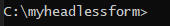
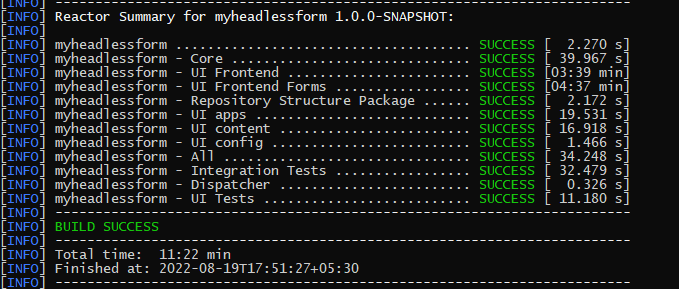
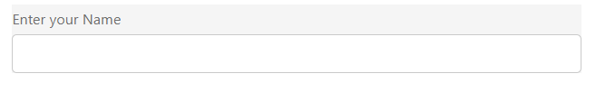
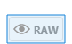
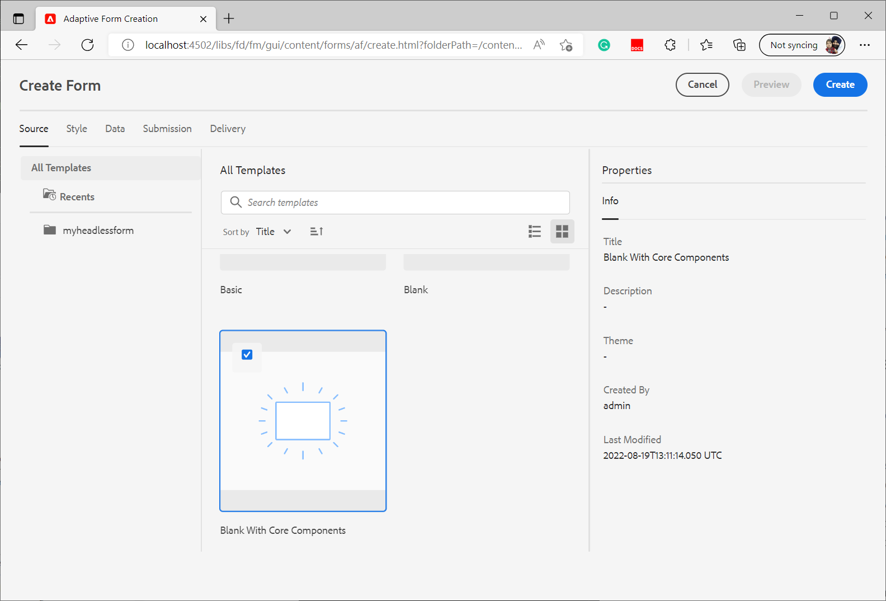

# Create your first Headless adaptive form

You can use Adobe Experience Manager Headless adaptive forms to build forms applications using front-end UI such as React and use Forms Web SDK for capabilities like state management, validation, and integrations with various other touchpoints.

For example, an organization We.Org is looking to digitize their customer enrollment journey. Their developers are well versed at using Angular to build frontend solutions. They are looking to build a custom front end while offloading form validation and electronic signatures to specialized solutions.

Adobe Experience Manager Headless adaptive forms provides such organizations freedom to build forms using their existing expertise in frontend languages while providing support to use back-end capabilities to create enterprise class forms experience.

<!-- >>[!VIDEO](https://video.tv.adobe.com/v/341011/) -->

<!--   -->

## Before you start

* Set up the [development environment](setup-development-environment.md) to enable you to create and test a Headless Adaptive Form on your local machine.
* The following software must be installed on your local development machine:  
    * [Java Development Kit 11](https://experience.adobe.com/#/downloads/content/software-distribution/en/general.html?1_group.propertyvalues.property=.%2Fjcr%3Acontent%2Fmetadata%2Fdc%3AsoftwareType&1_group.propertyvalues.operation=equals&1_group.propertyvalues.0_values=software-type%3Atooling&fulltext=Oracle%7E+JDK%7E+11%7E&orderby=%40jcr%3Acontent%2Fjcr%3AlastModified&orderby.sort=desc&layout=list&p.offset=0&p.limit=14)  
    * [Latest release of Git](https://git-scm.com/downloads). If you are new to Git, see [Installing Git](https://git-scm.com/book/en/v2/Getting-Started-Installing-Git).
    * [Node.js 16.13.0 or later](https://nodejs.org/en/download/). If you are new to Node.js, see [How to install Node.js](https://nodejs.dev/en/learn/how-to-install-nodejs).
    * [Maven 3.6 or later](https://maven.apache.org/download.cgi). If you are new to Maven, see [Installing Apache Maven](https://maven.apache.org/install.html).


## Use the archetype project to create a Headless adaptive form

The archetype project is a maven-based template. It creates a minimal project based on best practice to get started with Headless adaptive forms. It also includes Headless adaptive forms functionality for Forms as a Cloud Service and local development environments. It is mandatory to create and deploy the archetype 37 or later based project during the beta phase. Post-beta the project would be required only for customizations. 

Perform the following steps to create and render your first Headless adaptive form: 

1. [Create and deploy AEM Archetype based project](#create-an-archetype-based-project)
1. [Deploy the project to AEM SDK](#deploy-the-project-to-a-local-development-environment)
1. [Create JSON schema of Headless adaptive form and upload it to your AEM SDK instance](#create-add-json-representation-of-headless-adaptive-forms)
1. [Create an Adaptive Form based on the Blank with core components template](#create-adaptive-form-with-blank-with-core-components-template)


### 1. Create and deploy AEM Archetype based project {#create-an-archetype-based-project}  

Depending on the operating system, run the below command to create an Experience Manager Forms as a Cloud Service project. Use archetype version 37 or later. See, [Archetype documentation](https://experienceleague.adobe.com/docs/experience-manager-core-components/using/developing/archetype/overview.html) to find the latest version of Archetype.

**Microsoft Windows**

1. Open the command prompt with Administrative privileges (Run command prompt or bash shell as an administrator) 
1. Run the below command:

      ``` shell

        mvn -B org.apache.maven.plugins:maven-archetype-plugin:3.2.1:generate ^
        -D archetypeGroupId=com.adobe.aem ^
        -D archetypeArtifactId=aem-project-archetype ^
        -D archetypeVersion=37 ^
        -D appTitle=myheadlessform ^
        -D appId=myheadlessform ^
        -D groupId=com.myheadlessform ^
        -D includeFormsenrollment="y" ^
        -D includeFormsheadless="y" 
    
      ```

    * Set `appTitle` to define the title and components groups.
    * Set `appId` to define the Maven artifactId, the component, config and content folder names, and client library names.
    * Set `groupId` to define the Maven groupId and the Java Source Package.
    * Use the `includeFormsenrollment=y` option to include Forms specific configurations, themes, templates, Core Components, and dependencies required to create Adaptive Forms.
    * Use the `includeFormsheadless=y` option to include Forms Core Components and dependencies required to include Headless Adaptive Forms functionality. On enabling this option, the following are included:  
        * The **Blank with core components** template with [core components](https://experienceleague.adobe.com/docs/experience-manager-core-components/using/introduction.html?lang=en).
        * A frontend React module, `ui.frontend.react.forms.af`. It helps you render headless adaptive form in a react app.  


**Apple macOS or Linux**: 

1. Open terminal as a root user. It allows you to run commands with administrative privileges. You can also use `sudo root` command after opening the terminal window to run commands with administrative privileges.
1. Run the below command: 

      ``` shell

        mvn -B org.apache.maven.plugins:maven-archetype-plugin:3.2.1:generate \
        -D archetypeGroupId=com.adobe.aem \
        -D archetypeArtifactId=aem-project-archetype \
        -D archetypeVersion=37 \
        -D appTitle=myheadlessform \
        -D appId=myheadlessform \
        -D groupId=com.myheadlessform \
        -D includeFormsenrollment="y" \
        -D includeFormsheadless="y"  

      ```

    * Set `appTitle` to define the title and components groups.
    * Set `appId` to define the Maven artifactId, the component, config, content folder names, and client library names.
    * Set `groupId` to define the Maven groupId and the Java Source Package.
    *  Use the `includeFormsenrollment=y` option to include Forms specific configurations, themes, templates, Core Components, and dependencies required to create Adaptive Forms.
    * Use the `includeFormsheadless=y` option to include Forms Core Components and dependencies required to include Headless Adaptive Forms functionality. On enabling this option, the following are included:  
        * The **Blank with core components** template with [core components](https://experienceleague.adobe.com/docs/experience-manager-core-components/using/introduction.html?lang=en).
        * A frontend reacts module, `ui.frontend.react.forms.af`. It helps you render headless adaptive form in a react app.

On successful completion of the command, a project folder with name specified in the `appID` is created. For example, if you use `appID` with value `myheadlessform`, a folder named `myheadlessform` is created. It contains the Archetype based project.


### 2. Deploy the project to AEM SDK {#deploy-the-project-to-a-local-development-environment}

When you deploy the project to your AEM SDK instance, it adds Headless Adaptive Forms functionality, the **Blank with core components** template, and other resources included in the project to your development environment. <!-- Deploy the project to your local development environment to locally create Headless Adaptive Forms. or deploy directly to your Forms as a Cloud Service environment. !--> To deploy to your AEM SDK instance: 

1. Open command prompt. If you are on Windows, open the command prompt with Administrative privileges (Run command prompt or [Git bash shell](https://khushwantsehgal.wordpress.com/2022/06/29/check-if-git-bash-is-running-in-administrator-mode/)  as an administrator).

1.  Navigate to the project directory created in previous step. For example, `/myheadlessform`

    

1. Run the following command: 

    ``` shell

    mvn -PautoInstallPackage clean install
    
    ```

    Wait for the 'BUILD SUCCESS' message. 
   

   It can take long to resolve the dependencies and deploy the project. If there is a failure in deploying the project, see [troubleshooting](troubleshooting.md) article for common issues and their resolution.

    
<!-- *  To learn how to deploy code to AEM as a Cloud Service, see the video in [Deploying to AEM as a Cloud Service]https://experienceleague.adobe.com/docs/experience-manager-cloud-service/content/implementing/deploying/overview.html?lang=en#coding-against-the-right-aem-version) article : -->


### 3. Create JSON schema of headless adaptive form and upload it to your AEM SDK instance {#create-add-json-representation-of-headless-adaptive-forms}

A Headless Adaptive Forms is represented as a JSON file. You can get a sample form from [Storybook](https://opensource.adobe.com/aem-forms-af-runtime/storybook/?path=/story/reference-examples--contact) or use the sample form includes in Archetype Project at `[Archetype Project]\ui.content\src\main\content\jcr_root\content\dam\myheadlessform\af_model_sample.json`. This document uses the [introduction](https://opensource.adobe.com/aem-forms-af-runtime/storybook/?path=/story/reference-examples--introduction) form from Storybook. It is a single field form to help you quickly get started with Headless Adaptive Forms. <!-- The [specifications](/help/assets/Headless-Adaptive-Form-Specification.pdf) document provides detailed information about various components, rules, and constraints for Headless Adaptive Forms -->

To create and upload the schema:

1. Create a plain-text file with extension `.json`. For example, `myfirstform.json`. You can create the file anywhere on your file system or in your AEM Archetype based project at `\<project-name>\ui.content\src\main\content\jcr_root\content\dam\myheadlessform\<formname>.json` 
1. Add the following JSON content to your `.json` file and save it:

    ``` JSON
    {
      "adaptiveform": "0.10.0",
      "items": [
        {
          "fieldType": "text-input",
          "label": {
            "value": "Enter your Name"
          },
          "name": "textInput"
        }
      ],
      "metadata": {
        "grammar": "json-formula-1.0.0",
        "version": "1.0.0"
      }
    }
    ```

    It adds a single field to the form:
    
    

1. Log in to your [local AEM SDK instance](setup-development-environment.md#setup-author-instance)
1. Navigate to Adobe Experience Manager > Forms > Forms and Documents. Tap Create > File Upload. 
1. Select the `.json` created in step 2 and upload it. You are ready to create the Headless Adaptive form. If you save the .json file to your AEM Archetype based project at `\<project-name>\ui.content\src\main\content\jcr_root\content\dam\myheadlessform\<formname>.json`. You can use the `mvn -PautoInstallPackage clean install` to deploy the project to your AEM SDK and `<formname>.json` along with it.

If there is a failure in uploading the `.json`, ensure that the [AEM Archetype project is deployed successfully](#deploy-the-project-to-a-local-development-environment).

<!-- 1. Open the [contact form](https://opensource.adobe.com/aem-forms-af-runtime/storybook/?path=/story/reference-examples--contact) and tap the [](faq.md#storybook-example) icon on bottom-right side of the Storybook page to view the source code of the headless . 

You can use [Adaptive Forms builder extension for Visual Studio Code](/help/setup-development-environment.md#microsot-visual-studio-code-extension-for-headless-adaptive-forms) to build a JSON schema of your Headless Adaptive Forms. 

You can see [Storybook](https://opensource.adobe.com/aem-forms-af-runtime/storybook/?path=/story/reference-examples--introduction) for sample JSON schemas and list of components, attributes, and properties. You can also see the [specifications document](/help/assets/Headless-Adaptive-Form-Specification.pdf) for detailed information on all the components, constraints, and methods available to define Headless Adaptive Forms.

File extension of a JSON schema of Headless Adaptive Forms is .json. For example, formname.json. Create or add the file to your AEM Archetype based project. For example, `\myheadlessform\ui.content\src\main\content\jcr_root\content\dam\myheadlessform\home-loan.json` -> 

### 3. Deploy the project to a local development environment {#deploy-the-project-to-a-local-development-environment}

You can deploy the project to local development environment. It adds Headless Adaptive Forms functionality, the **Blank with core components** template, JSON schema of form, and other resources included in the project to your development environment. <!-- Deploy the project to your local development environment to locally create Headless Adaptive Forms. or deploy directly to your Forms as a Cloud Service environment. To deploy to your local development environment, use the following command: 

    `mvn -PautoInstallPackage clean install`

If you are on Windows, run the above with Administrative privileges (Run command prompt or [bash shell as an administrator](https://khushwantsehgal.wordpress.com/2022/06/29/check-if-git-bash-is-running-in-administrator-mode/)). For the complete list of commands, see [Building and Installing](https://experienceleague.adobe.com/docs/experience-manager-core-components/using/developing/archetype/using.html?lang=en#building-and-installing).
    
<!-- *  To learn how to deploy code to AEM as a Cloud Service, see the video in [Deploying to AEM as a Cloud Service]https://experienceleague.adobe.com/docs/experience-manager-cloud-service/content/implementing/deploying/overview.html?lang=en#coding-against-the-right-aem-version) article : -->

### 4. Create an Adaptive Form based on the Blank with core components template {#create-adaptive-form-with-blank-with-core-components-template}

1. Log in to your [AEM SDK instance](http://localhost:4502/). 

1. Navigate to Adobe Experience Manager > Forms > Forms and Documents.  

1. Tap Create and select Adaptive Form. Select the **Blank with core components** template and tap Create.

    

1. Specify the values for the following property fields. The Title and Name fields are mandatory:

   * **Title**: Specifies the display name of the form. The title helps you identify the form in the Experience Manager Forms user interface.
   * **Name**: Specifies the name of the form. A node with the specified name is created in the repository. As you start typing a title, value for the name field is automatically generated. You can change the suggested value. The name field can include only alphanumeric characters, hyphens, and underscores. All the invalid inputs are replaced with a hyphen.

1. Tap Create. An Adaptive Form is created.

If you do not see the **Blank with core components** template, ensure that the [AEM Archetype project is deployed successfully](#deploy-the-project-to-a-local-development-environment).

### 5. Configure the Adaptive Form to use the JSON schema {#configure-adaptive-form-to-use-the-JSON-representation}

The Adaptive Form created in previous step is blank. Configure the Adaptive Form to use the JSON schema:

1. Log in to your [AEM SDK instance](http://localhost:4502/). 

1. Navigate to Adobe Experience Manager > Forms > Forms and Documents. Select the Adaptive Form created in previous step and tap Edit. The Adaptive Form opens in the editor. 

1. Tap the Adaptive Forms Container component and Tap Properties. It displays properties explorer in the sidebar.

1. In the properties explorer, expand the BASIC accordion, and specify path of the JSON schema uploaded in a previous step for the Forms Runtime Document Path option. The container component displays a rendition of the form.

1. In the properties explorer, expand the SUBMISSION accordion and set a Submit Action for the adaptive form. Your form is ready to be used in a react app.

1. To render the form, hosted on your local development machine:

    1. Open the `[Archetype project]\ui.frontend.react.forms.af\.env` file and set the path of form. For example, /content/forms/af/contact

    1. Open the command prompt and navigate to the ui.frontend.react.forms.af project and run the following command:

        `npm run start`

    1. After the completion, open the localhost:3000 in your browser window to view rendered Headless Adaptive Form. 
    1. To test the submission functionality, login to your AEM Forms Server, and use the **Preview the form in HTML** option to open the form in preview mode. 

The [Storybook](https://opensource.adobe.com/aem-forms-af-runtime/storybook/) provides a list of components and rules that can be set on various Headless Adaptive Forms along with some example of JSON schema of Headless Adaptive Forms. You can also look at [specifications](/help/assets/Headless-Adaptive-Form-Specification.pdf) document to learn about various rules and properties related to Headless Adaptive Forms.
