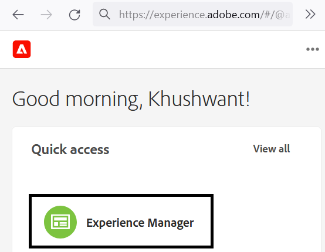
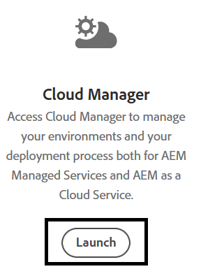
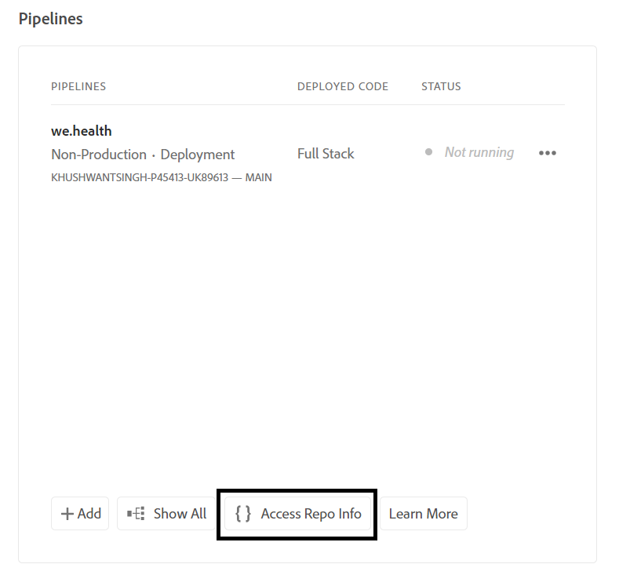

# Setup development environment for Headless adaptive forms on Cloud Service

<span class="preview"> This is a **WORK IN PROGRESS** article.</span>


Ready to build and test Headless adaptive forms on Cloud Service? Enable Forms for your Cloud Service program and get going.

## Before you begin

*  Install [Latest version of Git](https://git-scm.com/downloads) on your local machine. If you are new to Git, see [Installing Git](https://git-scm.com/book/en/v2/Getting-Started-Installing-Git). You use Git repository to push the forms and custom code developed on your local development environment to your Cloud Service development environment.

* Install [Node.js 16.13.0 or later](https://nodejs.org/en/download/) on your local machine. If you are new to Node.js, see [How to install Node.js](https://nodejs.dev/en/learn/how-to-install-nodejs).

* Create a AEM as a Cloud Service program: Follow step 1-7 of the [create program](https://experienceleague.adobe.com/docs/experience-manager-cloud-service/content/onboarding/demo-add-on/create-program.html?#create-program) article to create a program for your organization.

* Enable [Prerelease Channel for your Cloud Service program](https://experienceleague.adobe.com/docs/experience-manager-cloud-service/content/release-notes/prerelease.html?cloud-environments).

## Setup workflow

To enable Headless adaptive forms on your Forms as a Cloud Service Sandbox, enable `Forms - Digital enrolment` solution for your AEM Cloud Service program, create an Archetype 37 or later based project on your local machine, and push it to your Forms as a Cloud Service environment. The complete process is:


### 1. Enable Forms for your program

<table style="table-layout:auto">
<tr>
  <td>
  1. Log in to <a href="https://experience.adobe.com/" > https://experience.adobe.com/ </a>  and select the <b> Experience Manager </b> option.
  </td>
  <td>
    <a href="https://experienceleague.adobe.com/docs/experience-manager-cloud-service/content/onboarding/demo-add-on/create-program.html?#create-program">
      
    </a>
    <br>
  </td>
</tr>
<tr>
  <td>
  2. For the <b> Cloud Manager </b> option, click <b> Launch. </b> A list of programs for your organization appears.
  </td>
  <td>
    <a href="https://experienceleague.adobe.com/docs/experience-manager-cloud-service/content/onboarding/demo-add-on/create-program.html?#create-program">
      
    </a>
    <br>
  </td>
</tr>
<tr>
  <td>
    3. For your program, tap the ... icon, and select the <b> Edit Program </b> option. A dialog box appears. 
  </td>
  <td>
    <a href="https://experienceleague.adobe.com/docs/experience-manager-cloud-service/content/onboarding/demo-add-on/create-program.html?#create-program">
      
    </a>
    <br>
  </td>
</tr>
<tr>
  <td>
    4. On the Edit program dialog box, go to the <b> Solutions & Add-ons tab </b>, select the <b> Forms - Digital Enrollment </b> option, and tap <b> update </b>. 
  </td>
  <td>
    <a href="https://experienceleague.adobe.com/docs/experience-manager-cloud-service/content/onboarding/demo-add-on/create-program.html?#create-program">
      
    </a>
    <br>
  </td>
</tr>
</table>

### 2. Clone Git repository of your program to your local machine

Every AEM as a Cloud Service program has a git repository. It allows you to upload custom code and assets from local machine to your Cloud Service environment. During the setup, we use the Git repository to bring Headless adaptive forms related code, templates, and other information to your Cloud Service program from your local machine. Cloning the Cloud Service git repository on your local machine is the first step towards bringing custom code and content from your local machine to Cloud Service.

>[!INFO]
>
> You can always commit to a Git repository without cloning it. But, it has its own quirks. So, we are using the cloning approach in this document.  


To clone the repository:

<table style="table-layout:fixed">
<tr>
  <td>
  1. In pipeline box of your program, tap <b> Access Repo Info. </b> A dialog with Repository information appears 
  </td>
  <td>
    <a href="https://experienceleague.adobe.com/docs/experience-manager-cloud-service/content/onboarding/demo-add-on/create-program.html?#create-program">
      
    </a>
    <br>
  </td>
</tr>
<tr>
  <td>
  2. Tap <b> Generate Password </b> and copy the <b> Repository URL. </b> 
  </td>
  <td>
      
    <br>
  </td>
</tr>
<tr>
  <td>
    3. On your local machine, open the command prompt, create a folder, and run the following command, and provide the Repository Credentials, asked :
    </br>
    <code> git clone [Repository URL] </code> </br></br>
    For example, </br> 
    <code> git clone https://git.cloudmanager.adobe.com/stage-aemformsdev/khushwantsingh-p45413-uk89613/ </code>

</br> When asked, get the <b> Username</b> and <b>Password</b> from the <b>Repository Info</b> screen. 
  </td>
  <td>
     
  </td>
</tr>
</table>


### 3. Create an AEM Archetype-based project

The archetype project is a maven-based template. It creates a minimal project based on best practice to get started with Headless adaptive forms. It also includes core Headless adaptive forms functionality for Forms as a Cloud Service. It is mandatory to create and deploy the archetype 37 or later based project.
&reg;&reg;&reg;
Depending on the operating system, run the maven command to create an Experience Manager Forms as a Cloud Service project. Use archetype version 37 or later. See [Archetype documentation](https://experienceleague.adobe.com/docs/experience-manager-core-components/using/developing/archetype/overview.html) to find the latest version of Archetype.

+++ Microsoft&reg; Windows

1. Open the command prompt with Administrative privileges (Run command prompt or bash shell as an administrator).
1. Run the below command:

      ``` shell

        mvn -B org.apache.maven.plugins:maven-archetype-plugin:3.2.1:generate ^
        -D archetypeGroupId=com.adobe.aem ^
        -D archetypeArtifactId=aem-project-archetype ^
        -D archetypeVersion=37 ^
        -D appTitle=myheadlessform ^
        -D appId=myheadlessform ^
        -D groupId=com.myheadlessform ^
        -D includeFormsenrollment="y" ^
        -D includeFormsheadless="y" 
    
      ```
&trade;&trade;&trade;
    * Set `appTitle` to define the title and components groups.
    * Set `appId` to define the Maven artifactId, the component, config and content folder names, and client library names.
    * Set `groupId` to define the Maven groupId and the Java&trade; Source Package.
    * Use the `includeFormsenrollment=y` option to include Forms specific configurations, themes, templates, Core Components, and dependencies required to create Adaptive Forms.
    * Use the `includeFormsheadless=y` option to include Forms Core Components and dependencies required to include Headless adaptive forms functionality. On enabling this option, the following are included:  
        * The **Blank with core components** template with [core components](https://experienceleague.adobe.com/docs/experience-manager-core-components/using/introduction.html?lang=en).
        * A frontend React module, `ui.frontend.react.forms.af`. It helps you render Headless adaptive form in a react app.  

+++&reg;&reg;&reg;


+++ Apple macOS or Linux&reg;

1. Open terminal as a root user. It allows you to run commands with administrative privileges. You can also use `sudo root` command after opening the terminal window to run commands with administrative privileges.
1. Run the below command: 

      ``` shell

        mvn -B org.apache.maven.plugins:maven-archetype-plugin:3.2.1:generate \
        -D archetypeGroupId=com.adobe.aem \
        -D archetypeArtifactId=aem-project-archetype \
        -D archetypeVersion=37 \
        -D appTitle=myheadlessform \
        -D appId=myheadlessform \
        -D groupId=com.myheadlessform \
        -D includeFormsenrollment="y" \
        -D includeFormsheadless="y"  

      ```
&trade;&trade;&trade;
    * Set `appTitle` to define the title and components groups.
    * Set `appId` to define the Maven artifactId, the component, config, content folder names, and client library names.
    * Set `groupId` to define the Maven groupId and the Java&trade; Source Package.
    *  Use the `includeFormsenrollment=y` option to include Forms specific configurations, themes, templates, Core Components, and dependencies required to create Adaptive Forms.
    * Use the `includeFormsheadless=y` option to include Forms Core Components and dependencies required to include Headless adaptive forms functionality. On enabling this option, the following are included:  
        * The **Blank with core components** template with [core components](https://experienceleague.adobe.com/docs/experience-manager-core-components/using/introduction.html?lang=en).
        * A frontend reacts module, `ui.frontend.react.forms.af`. It helps you render Headless adaptive form in a react app.

+++

On successful completion of the command, a project folder with name specified in the `appID` is created. For example, if you use `appID` with value `myheadlessform`, a folder named `myheadlessform` is created. It contains the Archetype based project.

### 4. Push the AEM Archetype-based project to your Cloud Service environment

 1. Replace the content of the git repository with content on of Archtype-based project.

    >[!VIDEO](https://video.tv.adobe.com/v/3409809/)

 1. Open command prompt, navigate to your Git Repository folder, and run the below commands in the listed order to upload the replaced content to your Cloud Service environment. You can also use a visual editor instead of using the below commands to push content to Cloud Service repository. 

    ```
    
       git add .
       git commit
       git push origin

    ```

### 5. Run build pipeline for your program


<table style="table-layout:auto">
<tr>
  <td>
  1. Log in to <a href="https://experience.adobe.com/" > https://experience.adobe.com/ </a>  and select the <b> Experience Manager </b> option.
  </td>
  <td>
    <a href="https://experienceleague.adobe.com/docs/experience-manager-cloud-service/content/onboarding/demo-add-on/create-program.html?#create-program">
      
    </a>
    <br>
  </td>
</tr>
<tr>
  <td>
  2. For the <b> Cloud Manager </b> option, click <b> Launch. </b> A list of programs for your organization appears. Open your program. 
  </td>
  <td>
    <a href="https://experienceleague.adobe.com/docs/experience-manager-cloud-service/content/onboarding/demo-add-on/create-program.html?#create-program">
      
    </a>
    <br>
  </td>
</tr>
<tr>
  <td>
    3. For your pipeline, tap the ... icon, and select the <b> Run </b> option. If prompted to run pipeline, tap <b> Run </b> and wait for pipeline <b> Status </b>  to change to <b> Completed </b>.  
  </td>
  <td>
    <a href="https://experienceleague.adobe.com/docs/experience-manager-cloud-service/content/onboarding/demo-add-on/create-program.html?#create-program">
      
    </a>
    <br>
  </td>
</tr>
</table>

Now, your environment is ready for using Headless adaptive forms. You can now upload JSON definition of a form to your Cloud Service environment, create a Headless adaptive form based on it, and use the [getForm](https://opensource.adobe.com/aem-forms-af-runtime/api/#tag/Get-Form-Definition/operation/getForm) and other rest APIs to use the Headless adaptive form in your application or service.
