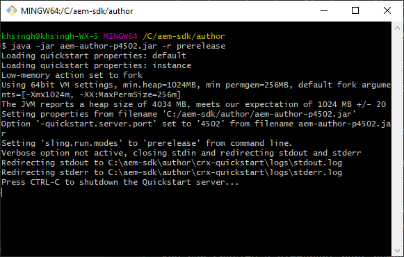

# Setup a local development environment {#headless-adaptive-forms-setup-development-environment}

You can setup a local development environment to create and test headless Adaptive Forms on your local machine. The development environment consists of AEM SDK and AEM Forms Feature Archive installed on AEM SDK.  
<!--
 After a Headless Adaptive Form or related assets are ready on the local development environment, you can deploy the Headless Adaptive Form application to your publishing environment. -- >

You require knowledge to build application using react, Git, and Maven to use Headless Adaptive Forms.

<!-- 

### Download the latest version of AEM as a Cloud Service SDK or Forms feature archive (AEM Forms add-on) from Software Distribution {#software-distribution}

To download the supported version of Adobe Experience Manager as a Cloud Service SDK or Forms feature archive (AEM Forms add-on):

1. Log in to [Software Distribution](https://experience.adobe.com/#/downloads) portal with your Adobe ID.

    >[!NOTE]
    >
    > Your Adobe Organization must be provisioned for AEM as a Cloud Service to download the AEM as a Cloud Service SDK.

1. Navigate to the **[!UICONTROL AEM as a Cloud Service]** tab.
1. Sort by published date in descending order.
1. Click on the latest Adobe Experience Manager as a Cloud Service SDK or Forms feature archive (AEM Forms add-on).
1. Review and accept the EULA. Tap the **[!UICONTROL Download]** button. -->

## System requirements {#headless-adaptive-forms-system-requirements}

To install AEM SDK, your local machine must meet these minimum requirements:

* [Java Development Kit 11](https://experience.adobe.com/#/downloads/content/software-distribution/en/general.html?1_group.propertyvalues.property=.%2Fjcr%3Acontent%2Fmetadata%2Fdc%3AsoftwareType&1_group.propertyvalues.operation=equals&1_group.propertyvalues.0_values=software-type%3Atooling&fulltext=Oracle%7E+JDK%7E+11%7E&orderby=%40jcr%3Acontent%2Fjcr%3AlastModified&orderby.sort=desc&layout=list&p.offset=0&p.limit=14)  
* [Latest release of Git](https://git-scm.com/downloads). If you are new to Git, see [Installing Git](https://git-scm.com/book/en/v2/Getting-Started-Installing-Git).
* [Node.js 16.13.0 or later](https://nodejs.org/en/download/). If you are new to Node.js, see [How to install Node.js](https://nodejs.dev/en/learn/how-to-install-nodejs).
* [Maven 3.6 or later](https://maven.apache.org/download.cgi). If you are new to Maven, see [Installing Apache Maven](https://maven.apache.org/install.html).

## Setup development environment {#headless-adaptive-forms-procedure-to-setup-development-environment}

To set up a new local development environment and use it to develop and test Headless Adaptive Forms:

1. [Set up AEM as a Cloud Service SDK](#setup-author-instance).
1. [Add AEM Forms archive (AEM Forms Cloud Service add-on) to AEM SDK](#add-forms-archive).

<!--

1. (Optional) [Add Forms-specific users to your local Author instance](#configure-users-and-permissions).
1. (Optional) Install [Adaptive forms builder extension for Microsoft Visual Studio Code](#microsoft-visual-studio-code-extension-for-headless-adaptive-forms). 

-->

### 1. Set up AEM as a Cloud Service SDK {#setup-author-instance}

AEM as a Cloud Service SDK (AEM SDK) provides developers with a local experience to create and test headless adaptive forms. You can use the AEM as a Cloud Service SDK to both create and preview headless adaptive forms, allowing you to perform most validations related to development locally. To setup a local author instance:

1. [Download](https://experience.adobe.com/#/downloads/content/software-distribution/en/aemcloud.html) the latest [!DNL Adobe Experience Manager] as a Cloud Service SDK. Use the Date Published column to sort and easily locate the latest SDK. 
It is in .zip format. The supported version is aem-sdk-2022.7.8085.20220725T140323Z-220700.zip and later.

    


1. Extract the downloaded .zip file to a directory on your local machine.
1. Create a directory on your local machine to serve as installation location for the author instance. For example, `~/aem-sdk/author`. 
1. Copy the .jar file from extracted SDK files to the installation location and rename the file to `aem-author-p4502.jar`. The `p4502` string in the filename specifies the port number to use. You can specify a different port number also.

    >[!NOTE]
    >
    > Do not double-click the .jar file to start it. It results in an [error](https://experienceleague.adobe.com/docs/experience-manager-learn/cloud-service/local-development-environment-set-up/aem-runtime.html?lang=en#troubleshooting-double-click).

1. Open the command prompt: 
    * On Windows, use the **Run as Administrator** option to open command prompt in elevated mode.
    * On Linux, ensure you open the terminal window as a root user.

1. Navigate to installation location containing copied .jar file, and run the following command:

    `java -jar aem-author-p4502.jar -r prerelease`

    

    *  The `-r prerelease` switch enables the features availabe only under the prerelease and beta programs.
    * You can use `admin` as username and password for local development to reduce the cognitive load.

    After AEM starts, the login page opens in web browser. You can also open the login page for AEM SDK instance at address `http://localhost:<port>` in your web browser. For example, [http://localhost:4502](http://localhost:4502).

1. Login to your Author instance. Tap the  icon, tap About Adobe Experience Manager, and ensure that the version number includes the PRERELEASE postfix.

    

If you do not see the PRERELEASE postfix, stop the server, delete the `[AEM SDK installation]/crx-quickstart folder`, and restart the AEM SDK .jar file with `-r prerelease` switch. For more options, see [Troubleshooting](/help/troubleshooting.md).

### 2. Add AEM Forms archive (AEM Forms Cloud Service add-on) to AEM SDK {#add-forms-archive}

AEM Forms as a Cloud Service feature archive (AEM Forms Cloud Service add-on) provides tools to create Headless Adaptive Forms on a local development environment. To install the feature archive:

1. Download and extract the latest [!DNL AEM Forms] feature archive (AEM Forms add-on) from [Software Distribution](https://experience.adobe.com/#/downloads/content/software-distribution/en/aemcloud.html?fulltext=AEM*+Forms*+add*+on*&orderby=%40jcr%3Acontent%2Fjcr%3AlastModified&orderby.sort=desc&layout=list&p.offset=0&p.limit=20). Use the Date Published column to sort and easily locate the latest SDK. The supported version is aem-forms-addon-2022.07.06.02-220600 and later.

1. Navigate to the crx-quickstart/install directory. If the folder does not exist, create it.
1. Stop your AEM SDK instance. You can terminate your command prompt window that is running AEM SDK instance to stop AEM.
1. Copy the [!DNL AEM Forms] add-on feature archive from file, `aem-forms-addon-<version>.far`, extracted in step 1 to the install folder.
1. Use the following command to restart the AEM SDK instance:

    `java -jar aem-author-p4502.jar -r prerelease`

<!-- 

### 3. (Optional) Configure users and permissions {#configure-users-and-permissions}

Create seperate user accounts for Form Developer, Form Practitioner, and end users. These account help you test Headless Adaptive Forms for various types of users. To create a user account and add roles to the account:

1. Login to your AEM SDK instance.
1. Go to Tools > Security > Users and tap Create. The Create New User wizard opens.
1. In the details tab, specify an ID and Password. All other fields are optional. It is recommended to provide name and an email address.
1. In the Groups tab, search and select user-groups for a user depending on their role. The table below lists all types of users and pre-defined groups for each type of forms users based on their role:
  
    | User Type | AEM Group |
    |---|---|
    | Form developer | [!DNL forms-users] (AEM Forms Users), [!DNL template-authors], [!DNL workflow-users], [!DNL workflow-editors], and [!DNL fdm-authors]  |
    | Customer Experience Lead or UX Designer| [!DNL forms-users], [!DNL template-authors]|
    | AEM administrator | [!DNL aem-administrators], [!DNL fd-administrators] |
    | End user| When a user must log in to view and submit an Adaptive Form, add such users to [!DNL forms-users] group. </br> When no user authentication is required to access Adaptive Forms, do not assign any group to such users.|

<!-- ### 4. (Optional) Install Visual Studio Code extension for headless adaptive forms {#microsoft-visual-studio-code-extension-for-headless-adaptive-forms}

You can use any IDE for developing Headless Adaptive Forms. Adobe provides an extension for Microsoft® Visual Studio Code to make it easier for you to navigate structure and develop headless adaptive forms. The extension adds adaptive forms related IntelliSense capabilities and helps auto-complete headless adaptive forms JSON syntax. It also adds a panel, titled Forms Tree, to help navigate structure of headless adaptive form. To use the extension: 

1. Ensure [Microsoft Visual Studio Code 1.62.0 or later](https://code.visualstudio.com/docs/supporting/FAQ#_how-do-i-find-the-version) is installed. If you have an older version or no version installed, download the latest version from [Microsoft Website](https://code.visualstudio.com/docs/setup/setup-overview)
   >[!NOTE]
   >
   >
   > To use Visual Studio from command line on macOS, see [Launching from the command line](https://code.visualstudio.com/docs/setup/mac#_launching-from-the-command-line).

1. Download the [Adaptive forms builder extension](/help/assets/adaptive-form-builder-0.12.0.vsix).

1. Navigate the directory containing the *adaptive-form-builder-[version].vsix* file.

1. Run the following command or see [Install from a VSIX](https://code.visualstudio.com/docs/editor/extension-marketplace#_install-from-a-vsix) article for detailed instructions to install a Visual Studio Code extension from a VSIX file:

    `code -–install-extension adaptive-form-builder-[version].vsix`

    </br> Replace the [version] with actual version of the extension. For example, `code -–install-extension adaptive-form-builder-0.12.0.vsix`

    </br> 

    

<!-- ## Create and setup a react app

Adaptive forms renderer component is a react based component. It requires a react app to run and render a headless adaptive form. To create and setup react app:

1. Open terminal in Visual Studio code and run the following command to create a react app and installs all related dependencies:

    ```shell
    npx create-react-app [react-app-name] --scripts-version 4.0.3 --template typescript
    ```

    Where [react-app-name] represents name of the project, script version is 4.0.3, and template of type typescript. For example, the following command creates a react app named *headless-forms-demo*.

    ```shell
    npx create-react-app headless-forms-demo --scripts-version 4.0.3 --template typescript
    ```

    It may take some time to create the react app and install all the dependencies. The command creates an empty react app with latest version of react and react-dom dependencies. It does not have any artifacts related to adaptive forms renderer component.

1. Adaptive forms renderer component is based on react spectrum and requires react 16.0.0 and react-dom 16.0.0. To install react 16.0.0 and related dependencies:
    1. Open the Visual Studio code terminal Window or command prompt.
    1. Navigate to the directory of react project.  
    1. Run the following command:

        ```shell
        npm install --save react@16.0.0 react-dom@16.14.0 -force
        ```

1. Run the following command to install adaptive forms renderer component related dependencies:

    ```shell
    npm i --save @aemforms/forms-super-component @aemforms/forms-react-core-components @aemforms/forms-super-component @adobe/react-spectrum @react/react-spectrum
    ```

<!-- 1. Install dependencies for adaptive forms renderer component. Packages for these dependencies are available in Adobe Artifactory. To authenticate with Adobe Artifactory and install dependencies for adaptive forms renderer component:

    1. Create environment variables ARTIFACTORY_USER and ARTIFACTORY_API_TOKEN. The ARTIFACTORY_USER stores Adobe LDAP username and ARTIFACTORY_API_TOKEN stores your [Adobe Artifactory token](https://wiki.corp.adobe.com/display/Artifactory/API+Keys)

    1. Run the following command to set NPM_TOKEN and NPM_EMAIL tokens:

        ```shell

        auth=$(curl -s -u${ARTIFACTORY_USER}:${ARTIFACTORY_API_TOKEN} https://artifactory.corp.adobe.com/artifactory/api/npm/auth)
        export NPM_TOKEN=$(echo "${auth}" | grep "_auth" | awk -F " " '{ print $3 }')
        export NPM_EMAIL=$(echo "${auth}" | grep "email" | awk -F " " '{ print $3 }')
        ```

        These tokens are required to communicated with Adobe Artifactory.

    1. Create a .npmrc file in the react project.

        

    1. Add the following code to the file:

        ```shell
        @aemforms:registry=https://artifactory.corp.adobe.com/artifactory/api/npm/npm-aem-release/
        @react:registry=https://artifactory.corp.adobe.com/artifactory/api/npm/npm-react-release/
        @quarry:registry=https://artifactory.corp.adobe.com/artifactory/api/npm/npm-adobe-release-local/
        //artifactory.corp.adobe.com/artifactory/api/npm/npm-adobe-release-loca/:_auth=${NPM_TOKEN}
        //artifactory.corp.adobe.com/artifactory/api/npm/npm-aem-release/:_auth=${NPM_TOKEN}
        //artifactory.corp.adobe.com/artifactory/api/npm/npm-react-release/:_auth=${NPM_TOKEN}
        _auth=${NPM_TOKEN}
        email=${NPM_EMAIL}
        always-auth=true
        ```

        It defines the antifactory repositories to use for Headless Adaptive Forms, react, and quarry related scope.
    1. Run the following command to install adaptive forms renderer component related dependencies:

    ```shell
    npm i --save @aemforms/crispr-react-bindings @aemforms/crispr-react-core-components @adobe/react-spectrum @react/react-spectrum
    ``` 
--> 
 Your local environment is ready. You can proceed to [create a Headless Adaptive Form](render-first-headless-adaptive-form.md).
