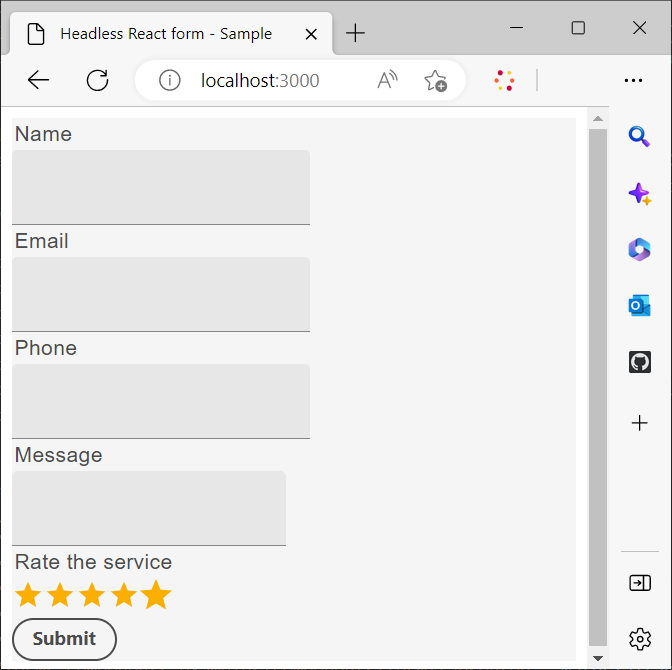
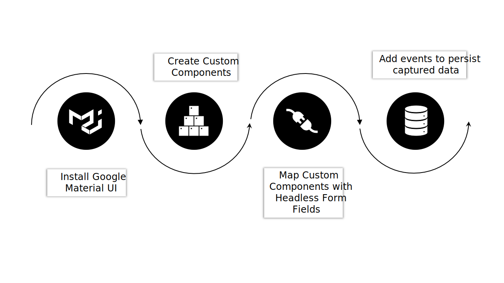
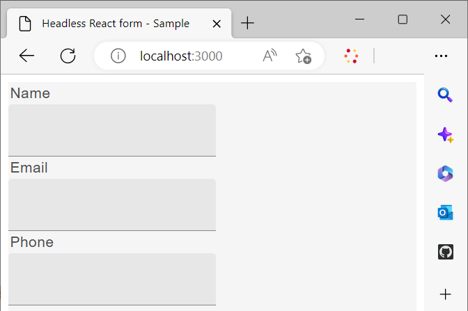

# Use a custom react library to render a headless form

You have the option to create and implement custom components to customize the appearance and functionality of your Headless adaptive form as per requirement and guidelines of your organization. 

These components serve two primary purposes: to control the appearance or style of form fields, and to store the data collected through these fields within the form model instance. If this sounds confusing, don't worry - we will explore these purposes in greater detail shortly. For now, let's focus on the initial steps of creating custom components, rendering the form using these components, and utilizing events to save and submit data to a REST endpoint.

In this tutorial, Google Material UI components are employed to demonstrate how to render a Headless adaptive form using custom React components. However, you are not limited to this library and are free to utilize any React components library or develop your own custom components.

By the conclusion of this article, the form created in [Create and publish a headless form using starter kit](create-and-publish-a-headless-form.md) article transforms into the following:




The major steps involved in using Google Material UI components to render a form are:



## 1. Install Google Material UI

By default, the starter kit uses [Adobe's Spectrum](https://spectrum.adobe.com/) components. Let's set it to use [Google's Material UI](https://mui.com/):

Open command prompt, navigate to the **react-starter-kit-aem-headless-forms** and run the following command:

```shell
    
    npm install @mui/material @emotion/react @emotion/styled --force
    
```

It installs the Google Material UI npm libraries and adds the libraries to starter kits dependencies. You can now use Material UI components to render form components.  


## 2. Create custom React components

Let's create a custom component that replaces default [text input](https://spectrum.adobe.com/page/text-field/) component with [Google Material UI Text Field](https://mui.com/material-ui/react-text-field/) component. 

A separate component is required for each component type ([fieldType](https://opensource.adobe.com/aem-forms-af-runtime/storybook/?path=/story/reference-json-properties-fieldtype--text-input) or :type) used in a Headless Form definition. For example, in the Contact Us form that you created in the previous section, the Name, Email, and Phone fields of type `text-input` ([fieldType: "text-input"](https://opensource.adobe.com/aem-forms-af-runtime/storybook/?path=/docs/adaptive-form-components-text-input-field--def)) and the message field is of type `multiline-input` (["fieldType": "multiline-input"](https://opensource.adobe.com/aem-forms-af-runtime/storybook/?path=/docs/reference-json-properties-fieldtype--multiline-input)). 


Let's create a custom component to overlay all form fields that use the [fieldType: "text-input"](https://opensource.adobe.com/aem-forms-af-runtime/storybook/?path=/docs/adaptive-form-components-text-input-field--def) property with [Material UI Text Field](https://mui.com/material-ui/react-text-field/) component. 

      
To create the custom component and map the custom component with the [fieldType](https://opensource.adobe.com/aem-forms-af-runtime/storybook/?path=/docs/adaptive-form-components-text-input-field--def) property :

   1.  Open the **react-starter-kit-aem-headless-forms** directory in a code editor and navigate to `\react-starter-kit-aem-headless-forms\src\components`.
  

   1.  Create a copy of the **slider** or **richtext** folder, and rename the copied folder to **materialtextfield**. Slider and richtext are two sample custom components available in the starter app. You can use these to create your own custom components.

        

   1.  Open the `\react-starter-kit-aem-headless-forms\src\components\materialtextfield\index.tsx` file and replace the existing code with the below code. This code returns and renders a [Google Material UI Text Field](https://mui.com/material-ui/react-text-field/) component.  
    
   ```JavaScript 
    
        import React from 'react';
        import {useRuleEngine} from '@aemforms/af-react-renderer';
        import {FieldJson, State} from '@aemforms/af-core';
        import { TextField } from '@mui/material';
        import Box from '@mui/material/Box';
        import { richTextString } from '@aemforms/af-react-components';
        import Typography from '@mui/material/Typography';


        const MaterialtextField = function (props: State<FieldJson>) {

            const [state, handlers] = useRuleEngine(props);

            return(

            <Box>
                <Typography component="legend">{state.visible ? richTextString(state?.label?.value): ""} </Typography>
                <TextField variant="filled"/>
            </Box>

            )
        }

        export default MaterialtextField;


   ```


The `state.visible` part checks if the component is set to be visible. If it is, the label of the field is retrieved and displayed using `richTextString(state?.label?.value)`.

   


Your custom component `materialtextfield` is ready. Let's set this custom component to replace all the instances of  [fieldType: "text-input"](https://opensource.adobe.com/aem-forms-af-runtime/storybook/?path=/docs/adaptive-form-components-text-input-field--def) with Google Material UI Text Field. 

## 3. Map custom component with headless form fields

The process of using a third-party library components to render form fields is know as mapping. You map each ([fieldType](https://opensource.adobe.com/aem-forms-af-runtime/storybook/?path=/story/reference-json-properties-fieldtype--text-input)) to corresponding component of third-party library. 

All the mapping-related information is added to the `mappings.ts` file. The `...mappings` statement in the `mappings.ts` file refers to the default mappings, which overlays the ([fieldType](https://opensource.adobe.com/aem-forms-af-runtime/storybook/?path=/story/reference-json-properties-fieldtype--text-input) or :type) with [Adobe Spectrum](https://spectrum.adobe.com/page/text-field/) components. 

To add mapping for the  `materialtextfield` component, created in last step:

1.  Open the `mappings.ts` file. 
     
1.  Add the following import statement to include the `materialtextfield` component to the `mappings.ts` file:

     
    ```JavaScript
  
        import MaterialtextField from "../components/materialtextfield";
          
           
    ```

1.  Add the following statement to map the `text-input` with the materialtextfield component. 


    ```JavaScript

        "text-input": MaterialtextField
        
         
    ```

    The final code of the file looks like the following :

    ```JavaScript

          import { mappings } from "@aemforms/af-react-components";
          import MaterialtextField from "../components/materialtextfield";


          const customMappings: any = {
            ...mappings,
            "text-input": MaterialtextField
         };
         export default customMappings;

    ```

1.  Save and run the app. The first three fields of the form are rendered using [Google Material UI Text Field](https://mui.com/material-ui/react-text-field/): 

    


    Similarly you can create custom components for message ("fieldType": "multiline-input") and rate the service ("fieldType":"number-input") fields. You can clone the  following Git repository for custom components of message and rate the service fields:  

    [https://github.com/singhkh/react-starter-kit-aem-headless-forms](https://github.com/singhkh/react-starter-kit-aem-headless-forms)

## Next step

You have successfully rendered the form with custom components that use Google Material UI. Have you tried submitting the form by clicking the Submit Button (Mapped with corresponding Google Material UI component)? If not, go ahead and give it a try. 

Is the form submitting the data to any data source? No? Don't worry. This is because your form is not configured to communicate with runtime library. 

How can you configure your form to communicate with it? We've got an article coming soon that will explain everything in detail. Stay tuned! 
